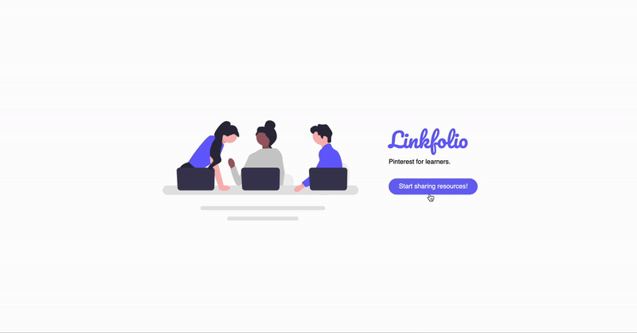
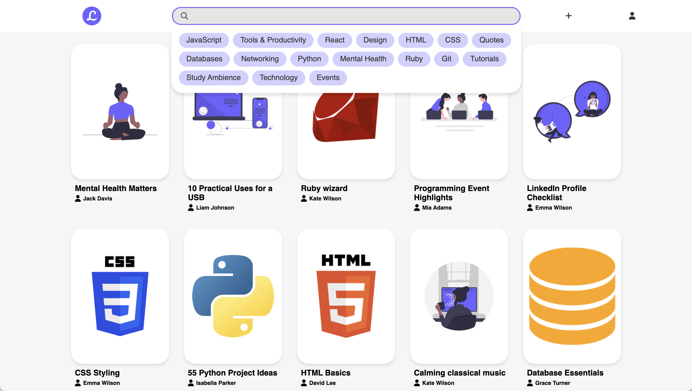
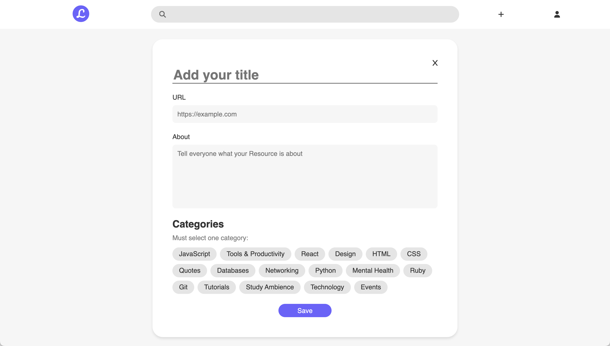
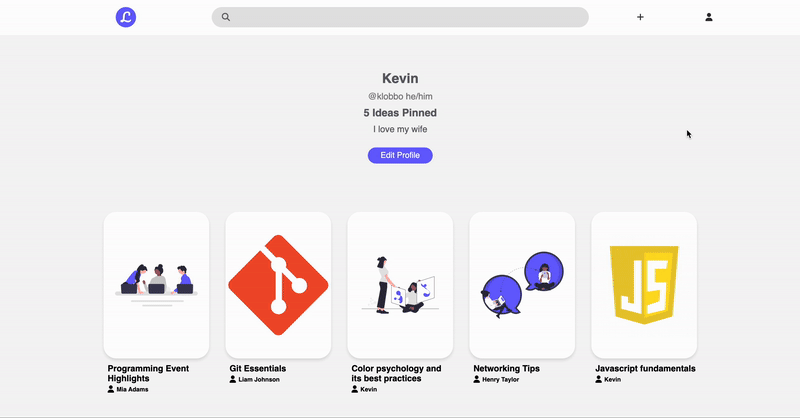
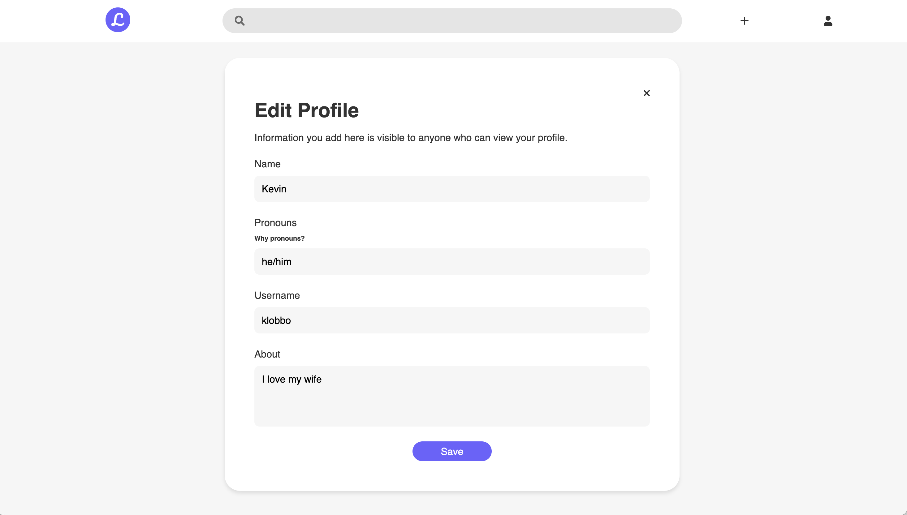
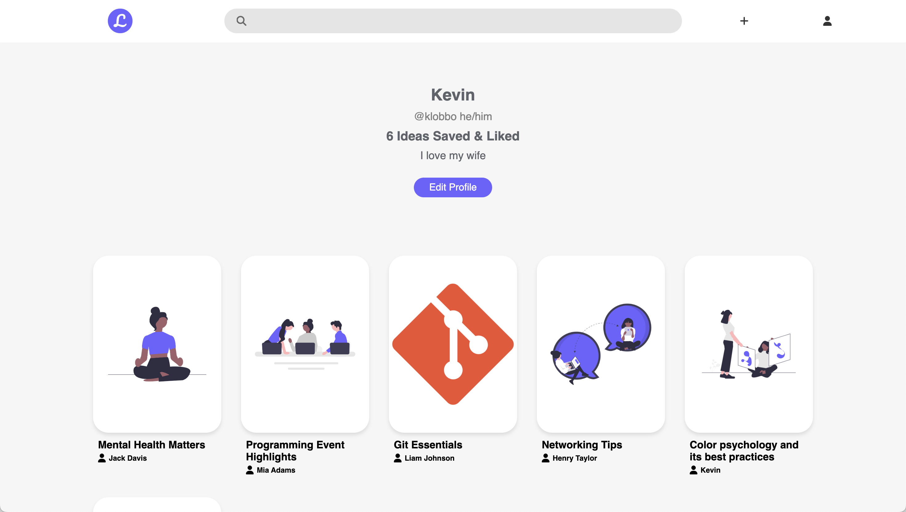
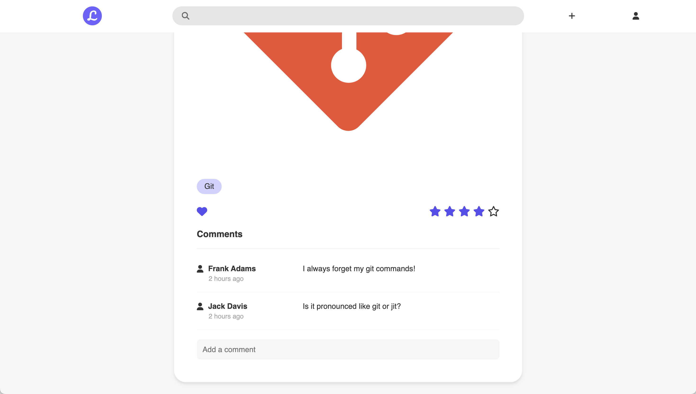

Linkfolio
=========
Pinterest for learners. 

A web app that allows learners to save learning resources like tutorials, blogs and videos in a central place that is publicly available to any user.

## Contributors
- [Rebecca Ariss](https://github.com/rebeccaariss) 
- [Kevin Lobsinger](https://github.com/klobsinger)
- [Caitlin Vandersluis](https://github.com/cvsluis)

## Purpose
This project was built as a part of our learnings at [Lighthouse Labs](https://www.lighthouselabs.ca).

## Final Product
**Project Demo: Like, comment, rate, and remove resource**

**View of Landing Page**

**View of Home Page with Search Feature**

**View of Add Resource Page**

**Project Demo: Add and search for resources**

**View of Edit Profile Page**

**View of User Profile Page**

**View of User Resource Interactions**

## Features
**Save a Resource**

Users can create and save a resource with a title, url, description, and category to their profile to store their most useful study resources in a central location.

**Like a Resource**

Logged in users can collect new and useful resources that others have added by using the heart icon to like a resource and save it to their own profile. 

**Rate a Resource**

Logged in users can leave a rating on any resource to visually understand which resources have been most helpful to them.

**Comment on a Resource**

Logged in users can leave a comment on a resource and engage with other users by leaving their thoughts or feedback.

**Categorize Resources**

All resources are organized by categories for helpful visual tags, and allow users to find good resources relevant to them.

**Search**

Any user can search the home page for the resource they are interested in! Using the search bar searches through the title, description and category of all resources.

**Update User Profile**

Logged in users can edit their profile name, username, or about me to let other users know what they're currently interested in. 

## Getting Started
1. Clone the repository onto your local device.
2. Create a local PostgreSQL database.
3. Create the `.env` by using `.env.example` as a reference
4. Update the `.env` file with your correct local information 
5. Install dependencies: `npm i`
6. Fix to binaries for sass: `npm rebuild node-sass`
7. Reset database: `npm run db:reset`
8. Run the server: `npm run local`
9. Visit `http://localhost:8080/` and start sharing resources!

## Dependencies
- [Express](https://expressjs.com)
- [Node.js](https://nodejs.org) v5.10.x or above
- [NPM](https://www.npmjs.com) 5.x or above
- [PG](https://www.npmjs.com/package/pg) 6.x
- [cookie-session](https://www.npmjs.com/package/cookie-session)
- [jQuery](https://jquery.com/)
- [SASS](https://www.npmjs.com/package/sass)
- [timeago.js](https://cdnjs.com/libraries/timeago.js)
